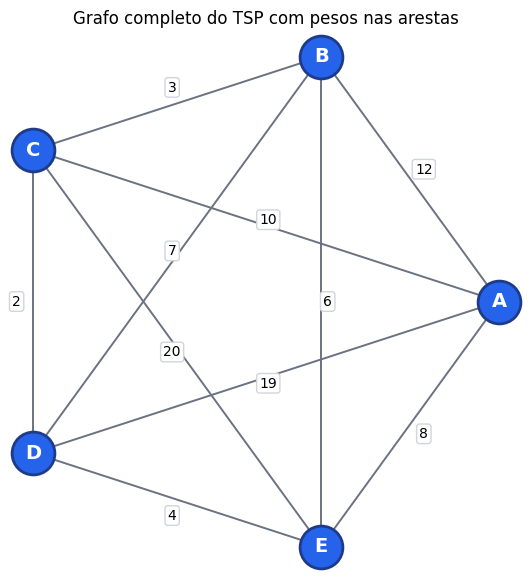
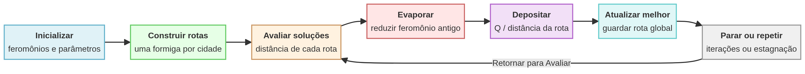
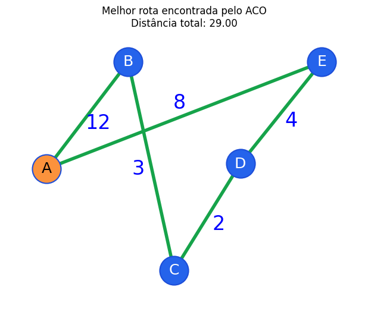
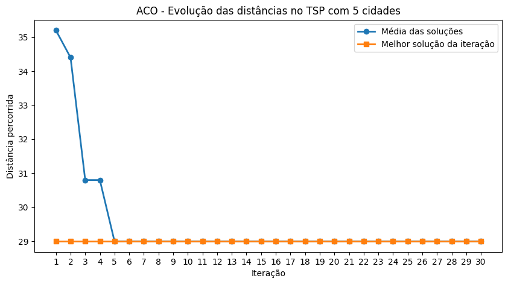
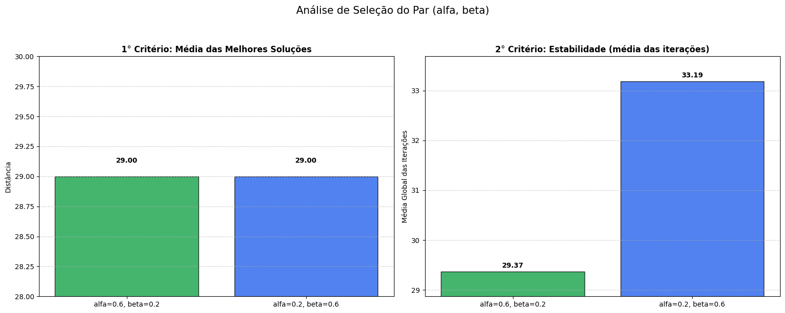
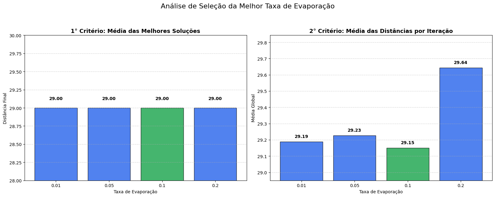
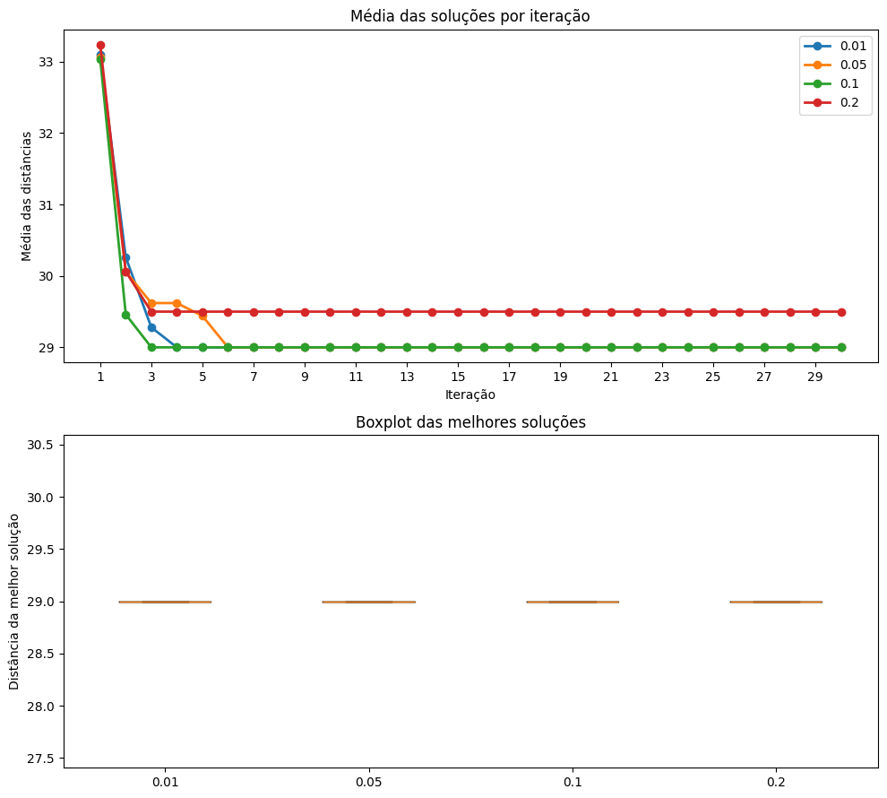
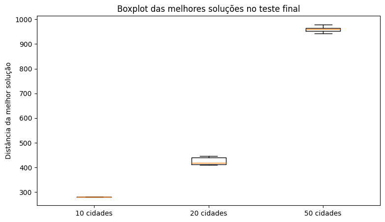
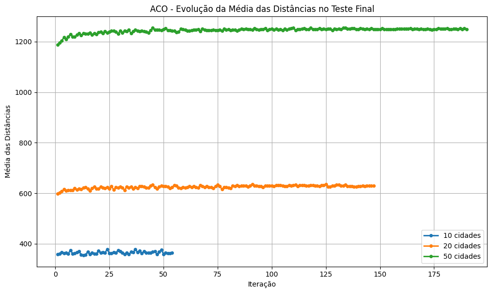

# Implementação e Avaliação do ACO para o Problema do Caixeiro Viajante

Este repositório contém uma implementação em Python do algoritmo Ant Colony Optimization (ACO) aplicado ao Problema do Caixeiro Viajante (TSP). Foram avaliadas instâncias com 5, 10, 20 e 50 cidades, analisando a influência de parâmetros (alfa, beta, evaporação, tamanho do torneio) sobre qualidade, estabilidade e tempo de execução.

## Sumário

- **Visão geral**
- **Instalação**
- **Execução**
- **Metodologia**
- **Resultados (com imagens)**
- **Complexidade**
- **Arquivos principais**

## Visão geral

O ACO implementado segue o esquema clássico: cada formiga constrói uma rota baseada em probabilidades que combinam feromônio e visibilidade (1/distância). Após cada iteração, ocorre evaporação do feromônio e depósito proporcional à qualidade das rotas. Para seleção das próximas cidades foi usado um mecanismo de torneio (subconjunto de candidatas).

## Instalação

Recomenda-se usar um ambiente virtual Python 3.8+. Exemplo rápido:

```bash
python -m venv .venv
source .venv/bin/activate
pip install -r requirements.txt  # ou: pip install numpy matplotlib
```

Observação: O notebook `aco_tsp.ipynb` já contém uma célula com `%pip install matplotlib` para conveniência.

## Execução

- Abra o notebook [aco_tsp.ipynb](aco_tsp.ipynb) em um ambiente Jupyter (JupyterLab ou Jupyter Notebook).
- Execute as células na ordem apresentada. O notebook está organizado em seções: funções, versão básica (item A), análise de parâmetros (item B e C) e testes finais com 10/20/50 cidades.

## Metodologia

- Implementação em Python usando `numpy` e `matplotlib`.
- Cada formiga inicia em uma cidade distinta; para cada iteração todas as formigas constroem rotas completas.
- Parâmetros controlados: `alfa`, `beta`, `evaporação`, `Q`, número de iterações, tamanho do torneio.
- Critério de parada para testes maiores: estagnação por `x` iterações (padrão `x = 50`) ou limite máximo de iterações (`max = 500`).

## Resultados (figuras)

As imagens abaixo foram geradas pelo notebook e estão na pasta `imagens/`.

- Figura 1 — Instância base (5 cidades): grafo completo com pesos



- Figura 2 — Fluxo geral do algoritmo ACO (pseudocódigo / diagrama)



- Figura 3 — Melhor rota encontrada para a instância de 5 cidades



- Figura 4 — Convergência (evolução das distâncias)



- Figura 5 — Análise comparativa dos pares (alfa, beta)



- Figura 6 — Seleção da melhor taxa de evaporação



- Figura 7 — Média das soluções por iteração (teste final)



- Figura 8 — Boxplot das melhores soluções (teste final)



- Figura 9 — Evolução da média das dintãncias (teste final)



## Complexidade

O TSP é NP‑difícil: o número de rotas cresce fatorialmente com `n` (em torno de $O(n!)$; ciclos distintos ≈ $\frac{(n-1)!}{2}$ no caso simétrico). A complexidade prática do ACO implementado depende de `I` (iterações), `m` (formigas, aqui igual a `n`) e `n` (cidades). O custo por iteração é aproximadamente $O(m\cdot n^2)$, levando a custo total aproximado $O(I\cdot m\cdot n^2)$.

## Arquivos principais

- `aco_tsp.ipynb` — Notebook com toda a implementação, experimentos e visualizações.
- `RELATORIO.md` — Relatório do trabalho (explora resultados e discussão).
- `imagens/` — Figuras geradas pelo notebook utilizadas neste README e no relatório.

