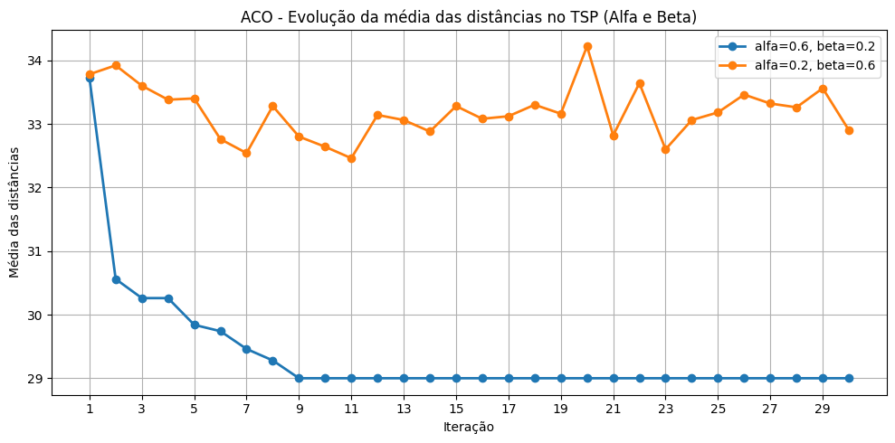

# Relatório: ACO aplicado ao Problema do Caixeiro Viajante

## Introdução

O problema atacado neste trabalho é o **Problema do Caixeiro Viajante** (*Travelling Salesman Problem*, TSP). Nele, considera-se um conjunto de cidades e as distâncias entre cada par de cidades. O objetivo é encontrar uma rota fechada de menor custo possível, na qual cada cidade seja visitada exatamente uma vez e, ao final, o percurso retorne à cidade de origem.

Do ponto de vista computacional, o TSP é um problema clássico de otimização combinatória. Mesmo em instâncias pequenas, o número de rotas possíveis cresce rapidamente com a quantidade de cidades. Em um grafo completo com `n` cidades, existem muitas permutações possíveis de visitação, o que torna inviável testar todas as rotas em instâncias maiores. Por esse motivo, é comum utilizar metaheurísticas capazes de encontrar boas soluções sem necessariamente enumerar todo o espaço de busca.

Neste projeto foi implementado o algoritmo **Ant Colony Optimization** (ACO), inspirado no comportamento coletivo de formigas. Na natureza, formigas depositam feromônio nos caminhos percorridos; caminhos mais curtos tendem a ser reforçados mais rapidamente, pois são percorridos com maior frequência. No algoritmo, esse comportamento é modelado por uma matriz de feromônios associada às arestas do grafo. Cada formiga constrói uma rota, as melhores rotas recebem reforço, e parte do feromônio evapora ao longo das iterações para evitar dependência excessiva de decisões iniciais.

A instância inicial do trabalho possui 5 cidades (`A`, `B`, `C`, `D` e `E`) e foi representada como um grafo completo ponderado. A Figura 1 resume essa instância.


## Materiais e Métodos

A implementação foi desenvolvida em Python no notebook [`aco_tsp.ipynb`](aco_tsp.ipynb). Foram utilizados recursos da linguagem para manipulação de listas, conjuntos e matrizes, além de rotinas auxiliares para cálculo estatístico, execução repetida dos experimentos e visualização dos resultados.

### Complexidade computacional

O Problema do Caixeiro Viajante (TSP) é um problema combinatório NP‑difícil: o espaço de soluções cresce de forma fatorial com o número de cidades, frequentemente descrito por $O(n!)$ (mais precisamente, para o TSP simétrico o número de ciclos distintos é aproximadamente $\frac{(n-1)!}{2}$). Isso implica que métodos exatos tornam‑se impraticáveis conforme $n$ cresce.

No contexto do notebook `aco_tsp.ipynb`, a metaheurística ACO apresenta custo computacional que depende do número de formigas $m$, do número de cidades $n$ e do número de iterações $I$. Para uma implementação típica, o custo por iteração é da ordem de $O(m\cdot n^2)$ (cada formiga escolhe sequencialmente cidades restantes e atualizações de feromônio percorrem as arestas da rota), resultando em custo total aproximado $O(I\cdot m\cdot n^2)$.

Em termos práticos, o "pior caso" do problema refere‑se à necessidade de explorar grande parte do espaço de busca para localizar soluções de alta qualidade, situação em que algoritmos exatos exigem tempo exponencial/fatorial; para ACO, o pior caso traduz‑se em muitas iterações e/ou muitas formigas até convergir, elevando o tempo total proporcionalmente a $I\cdot m\cdot n^2$.

O "melhor caso" ocorre quando a instância possui estrutura favorável (por exemplo, rotas claramente dominantes ou distâncias que tornam escolhas locais óbvias), permitindo que heurísticas como ACO encontrem boas soluções rapidamente; nesse cenário prático, a convergência pode acontecer em poucas iterações e o custo real fica bem abaixo do limite teórico, principalmente para pequenas $n$ como na instância inicial usada aqui.


A instância base utiliza a seguinte matriz de distâncias:

| Cidade | A | B | C | D | E |
|---|---:|---:|---:|---:|---:|
| A | 0 | 12 | 10 | 19 | 8 |
| B | 12 | 0 | 3 | 7 | 6 |
| C | 10 | 3 | 0 | 2 | 20 |
| D | 19 | 7 | 2 | 0 | 4 |
| E | 8 | 6 | 20 | 4 | 0 |

Cada aresta do grafo possui dois valores importantes para a decisão das formigas:

```text
tau(i,j) = quantidade de feromônio na aresta entre i e j
eta(i,j) = visibilidade da aresta = 1 / distancia(i,j)
```

A atratividade de uma cidade candidata é calculada por:

```text
atratividade(i,j) = tau(i,j)^alfa * eta(i,j)^beta
```

O parâmetro `alfa` controla a influência do feromônio, enquanto `beta` controla a influência da visibilidade, isto é, a preferência por arestas mais curtas. A evaporação reduz o feromônio acumulado a cada iteração, e o parâmetro `Q` controla a quantidade de reforço depositada nas rotas construídas.

Na versão básica foram utilizados os seguintes parâmetros:

| Parâmetro | Valor |
|---|---:|
| Número de cidades | 5 |
| Iterações | 30 |
| Alfa | 1 |
| Beta | 1 |
| Evaporação | 0.03 |
| Feromônio inicial | 0.1 |
| Q | 10 |
| Método de escolha | Torneio |

No método de escolha por torneio, a formiga não avalia necessariamente todas as cidades não visitadas. Em vez disso, um subconjunto de candidatas é sorteado e vence a cidade com maior atratividade. Essa estratégia introduz aleatoriedade controlada no processo: o algoritmo explora alternativas, mas ainda favorece arestas com bom histórico de feromônio e distância menor.

O fluxo geral do algoritmo implementado é apresentado na Figura 2.


O pseudocódigo do ACO utilizado é:

```text
Inicializar a matriz de feromônios com feromônio_inicial
Zerar a diagonal da matriz de feromônios

Para cada iteração:
    rotas = []
    distâncias = []

    Para cada cidade inicial:
        criar uma formiga nessa cidade
        rota = [cidade inicial]
        não_visitadas = todas as cidades exceto a inicial

        Enquanto existirem cidades não visitadas:
            sortear candidatas para o torneio
            calcular atratividade das candidatas
            escolher a candidata mais atrativa
            adicionar cidade escolhida à rota
            remover cidade escolhida de não_visitadas

        calcular distância total da rota fechada
        armazenar rota e distância
        atualizar melhor solução global, se necessário

    evaporar feromônio em todas as arestas

    Para cada rota construída:
        depósito = Q / distância da rota
        adicionar depósito nas arestas da rota

Retornar melhor rota, melhor distância e histórico das iterações
```

Além da execução básica, foram feitas análises de parâmetros. Primeiro, compararam-se os pares `(alfa=0.6, beta=0.2)` e `(alfa=0.2, beta=0.6)`, com 10 execuções por configuração. Depois, usando o melhor par escolhido, foram testadas as taxas de evaporação `0.01`, `0.05`, `0.1` e `0.2`, também com 10 execuções por configuração.

Por fim, o algoritmo foi aplicado a grafos completos com 10, 20 e 50 cidades. Essas instâncias foram geradas a partir de coordenadas aleatórias e distâncias euclidianas arredondadas. Nessa etapa, foi usado critério de parada por estagnação: a execução termina quando não há melhoria por 50 iterações consecutivas, respeitando o limite máximo de 500 iterações.

## Resultados e Discussão

Na instância básica com 5 cidades, o ACO encontrou uma rota de custo total `29`. Uma das rotas equivalentes observadas foi:

```text
A -> E -> D -> C -> B -> A
```

Essa rota utiliza as arestas `A-E`, `E-D`, `D-C`, `C-B` e `B-A`, com pesos `8`, `4`, `2`, `3` e `12`. A soma desses valores resulta em:

```text
8 + 4 + 2 + 3 + 12 = 29
```

A Figura 3 destaca essa solução sobre a instância original.


A evolução das soluções ao longo das 30 iterações indica o comportamento esperado do ACO: nas primeiras iterações, as formigas ainda exploram rotas mais variadas; com o reforço de feromônio, os trechos de menor custo passam a ser escolhidos com maior frequência. A tendência é a queda da média das soluções até a estabilização próxima da melhor distância encontrada.


Na comparação entre `alfa` e `beta`, os dois pares avaliados encontraram a melhor distância final em todas as execuções. Isso ocorre porque a instância com 5 cidades é pequena e possui um espaço de busca reduzido. Ainda assim, a comparação é útil para interpretar o papel dos parâmetros.

| Parâmetro | Média | Mediana | Moda | Desvio padrão | Mínimo | Máximo |
|---|---:|---:|---:|---:|---:|---:|
| alfa=0.6, beta=0.2 | 29.00 | 29.00 | 29.00 | 0.00 | 29.00 | 29.00 |
| alfa=0.2, beta=0.6 | 29.00 | 29.00 | 29.00 | 0.00 | 29.00 | 29.00 |

Como houve empate na qualidade final, foi escolhido o par `alfa = 0.6` e `beta = 0.2`. Essa escolha dá peso relativamente maior ao feromônio, valorizando o aprendizado coletivo da colônia nas etapas seguintes.





Na etapa de evaporação, todas as taxas também chegaram à melhor distância final `29`, mas a média das distâncias ao longo das iterações diferenciou o comportamento das configurações. A taxa `0.05` apresentou a menor média global durante o processo de busca, sendo selecionada para o teste final.

| Evaporação | Média final | Mediana | Moda | Desvio padrão | Mínimo | Máximo |
|---|---:|---: |---:|---:|---:|---:|
| 0.01 | 29.00 | 29.00 | 29.00 | 0.00 | 29.00 | 29.00 |
| 0.05 | 29.00 | 29.00 | 29.00 | 0.00 | 29.00 | 29.00 |
| 0.10 | 29.00 | 29.00 | 29.00 | 0.00 | 29.00 | 29.00 |
| 0.20 | 29.00 | 29.00 | 29.00 | 0.00 | 29.00 | 29.00 |

Esse resultado sugere que `0.05` ofereceu melhor equilíbrio entre memória e exploração. Com evaporação muito baixa, o algoritmo mantém por mais tempo informações possivelmente ruins do começo da busca. Com evaporação mais alta, o algoritmo esquece rapidamente os rastros, o que pode dificultar a consolidação das boas rotas. Na instância testada, `0.05` foi a configuração mais estável.


No teste final, os parâmetros escolhidos foram aplicados a instâncias maiores. Os resultados estão resumidos na tabela a seguir.

| Problema | Torneio | Média | Mediana | Moda | Desvio padrão | Mínimo | Máximo | Tempo médio (s) | Iterações médias |
|---|---:|---:|---:|---:|---:|---:|---:|---:|---:|
  10 cidades |        4 |   281.00 |   281.00 |   281.00 |     0.00 |   281.00 |   281.00 |          0.0603 |       51.90
  20 cidades |        6 |   414.70 |   408.50 |   397.00 |    15.55 |   397.00 |   437.00 |          1.0673 |       95.60
  50 cidades |        8 |   966.00 |   968.50 |   933.00 |    19.98 |   933.00 |   991.00 |          2.4031 |       73.00


---

Observa-se que o aumento do número de cidades eleva a distância média das rotas, o tempo de execução e a variação entre as execuções. Para 10 cidades, o algoritmo foi bastante estável e encontrou o mesmo resultado nas 10 repetições. Para 20 e 50 cidades, a dispersão aumentou, o que é esperado em uma metaheurística estocástica aplicada a espaços de busca maiores.

O crescimento da dificuldade também aparece no número médio de iterações até a parada por estagnação. Com mais cidades, há mais combinações possíveis e mais oportunidades de o algoritmo explorar regiões diferentes do espaço de soluções. Ainda assim, o critério de parada evitou execuções desnecessariamente longas, encerrando os testes antes do limite máximo de 500 iterações.

De modo geral, o ACO apresentou comportamento adequado para o TSP nas instâncias avaliadas. A instância de 5 cidades permitiu verificar a lógica do método e visualizar claramente a convergência. Os testes de parâmetros mostraram que, em problemas pequenos, configurações diferentes podem chegar ao mesmo resultado final, mas ainda podem diferir na estabilidade do processo. Nas instâncias maiores, ficou evidente o aumento da complexidade, refletido na maior dispersão das soluções e no aumento do tempo de processamento.

Conclui-se que o ACO é uma abordagem viável para buscar boas soluções para o Problema do Caixeiro Viajante. O método combina exploração aleatória com reforço progressivo das melhores rotas, o que permite encontrar soluções de boa qualidade sem percorrer exaustivamente todas as combinações possíveis.