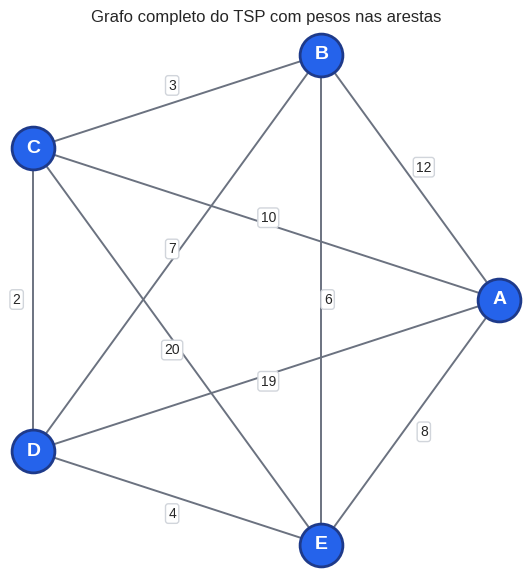
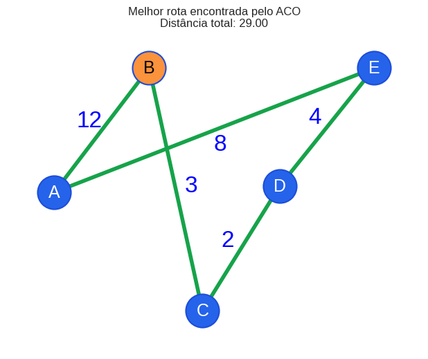
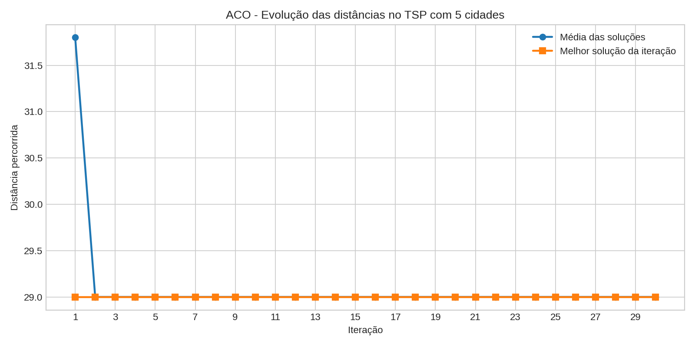
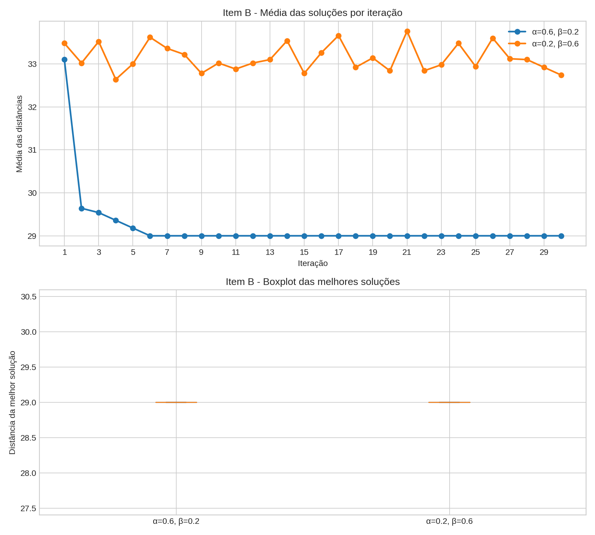
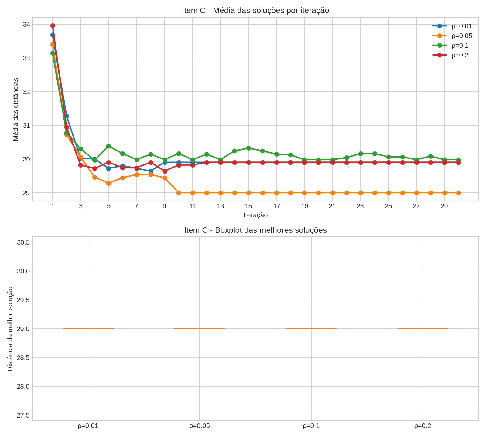
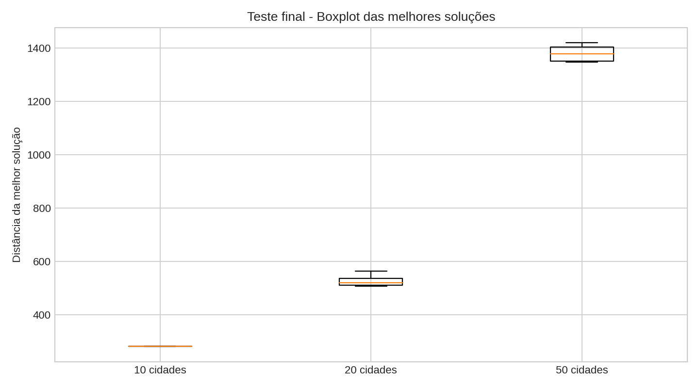

# Contexto completo do projeto ACO Caixeiro Viajante

Este arquivo registra o contexto atual do trabalho, o que já foi feito, quais arquivos existem, como as alterações vêm sendo feitas e como continuar o desenvolvimento em uma nova conversa sem começar do zero.

## Local do projeto

O projeto está em:

```text
/home/joao-kennedy/Documentos/cn2/ACO_Caixeiro_Viajante
```

Arquivos principais atuais:

```text
aco_tsp.ipynb
RELATORIO.md
README.md
SKILL.md
Comp. Natural - Inteligência de Enxames - Formigas ACO.pdf
imagens/
```

Arquivos de imagem gerados para o relatório:

```text
imagens/item_a_grafo_inicial.png
imagens/item_a_rota.png
imagens/item_a_evolucao.png
imagens/item_b_alfa_beta.png
imagens/item_c_evaporacao.png
imagens/teste_final_boxplot.png
```

## Pedido original do trabalho

O tema é:

```text
Tema 2: Implementação e avaliação do algoritmo ACO para o problema do Caixeiro Viajante
para 5, 10, 20 e 50 cidades.
```

O algoritmo deve resolver o problema do Caixeiro Viajante em um grafo totalmente conexo. Cada cidade é um vértice, cada aresta representa ligação entre duas cidades, e cada aresta possui um peso que representa a distância.

Foram solicitados:

1. Item A: versão básica para 5 cidades.
2. Item B: testar influência de alfa e beta.
3. Item C: testar influência da taxa de evaporação.
4. Teste final com 10, 20 e 50 cidades, usando os parâmetros escolhidos.
5. Relatório em Markdown com Introdução, Materiais e Métodos, pseudocódigo, Resultados e Discussão.

## Referência usada para ACO

Existe um arquivo local chamado `SKILL.md` com a referência didática do ACO. Ele foi usado como base conceitual. A formulação usada no notebook foi:

```text
eta(i,j) = 1 / distancia(i,j)
atratividade(i,j) = tau(i,j)^alfa * eta(i,j)^beta
```

Essa formulação também corresponde ao modelo clássico de ACO para TSP, como em Dorigo e Gambardella.

No notebook, como o enunciado pedia seleção por torneio, a atratividade é usada para decidir a melhor cidade entre candidatas sorteadas no torneio.

## Como estou fazendo as alterações

As alterações no notebook estão sendo feitas diretamente no JSON do `.ipynb`. O padrão usado é:

1. Ler o notebook com Python:

```python
import json
from pathlib import Path

path = Path("aco_tsp.ipynb")
nb = json.loads(path.read_text())
```

2. Procurar células pelo conteúdo:

```python
for cell in nb["cells"]:
    src = "".join(cell.get("source", []))
    if "texto ou função procurada" in src:
        ...
```

3. Substituir o conteúdo da célula:

```python
cell["source"] = novo_codigo.splitlines(keepends=True)
```

4. Limpar saídas antigas para evitar imagens e tracebacks salvos:

```python
for cell in nb["cells"]:
    if cell.get("cell_type") == "code":
        cell["outputs"] = []
        cell["execution_count"] = None
```

5. Salvar de volta:

```python
path.write_text(json.dumps(nb, ensure_ascii=False, indent=1) + "\n")
```

Observação importante: o usuário pediu para não colocar mais blocos de dependências como:

```python
dependencias_c = [...]
faltando_c = [...]
raise RuntimeError(...)
```

Então, daqui em diante, não adicionar esse tipo de checagem. Assumir que o notebook será executado em ordem, do início ao fim.

## Estado atual do notebook `aco_tsp.ipynb`

O notebook está estruturado em:

1. Item A: versão básica.
2. Item B: influência de alfa e beta.
3. Item C: influência da evaporação.
4. Teste final com 10, 20 e 50 cidades.

### Imports atuais

O notebook usa:

```python
import random
import time
from dataclasses import dataclass
import matplotlib
import matplotlib.pyplot as plt
import numpy as np
plt.style.use("seaborn-v0_8-whitegrid")
```

Não usa `pandas`, porque o ambiente não tinha esse pacote instalado.

### Item A

O item A implementa a versão básica com 5 cidades.

Parâmetros:

```text
iteracoes = 30
alfa = 1
beta = 1
evaporacao = 0.03
feromonio_inicial = 0.1
q = 10
tamanho_torneio = 3
```

Grafo com 5 cidades:

```python
cidades = ["A", "B", "C", "D", "E"]

distancias = np.array(
    [
        [0, 12, 10, 19, 8],
        [12, 0, 3, 7, 6],
        [10, 3, 0, 2, 20],
        [19, 7, 2, 0, 4],
        [8, 6, 20, 4, 0],
    ],
    dtype=float,
)
```

Esse grafo é simétrico, diagonal zero, e totalmente conexo.

Principais funções do item A:

```python
distancia_rota(rota, matriz_distancias)
escolher_proxima_cidade_torneio(...)
construir_rota(...)
atualizar_feromonios(...)
executar_aco(...)
```

`executar_aco` usa aleatoriedade sem semente fixa. A semente `42` foi removida a pedido do usuário, para cada execução poder gerar comportamento diferente.

A melhor rota vista nas últimas execuções geralmente é equivalente a:

```text
A -> E -> D -> C -> B -> A
```

com distância:

```text
8 + 4 + 2 + 3 + 12 = 29
```

Por ser um ciclo, rotas equivalentes podem aparecer em outra ordem, por exemplo:

```text
B -> C -> D -> E -> A -> B
```

Isso representa a mesma solução circular.

### Visualizações do item A

Foram adicionadas visualizações:

1. Grafo inicial completo, com todos os pesos.
2. Melhor rota encontrada.
3. Gráfico de evolução da média das soluções por iteração.

As imagens salvas para relatório são:

```text
imagens/item_a_grafo_inicial.png
imagens/item_a_rota.png
imagens/item_a_evolucao.png
```

### Matriz da melhor rota

O notebook possui a função:

```python
def matriz_melhor_rota(rota, matriz_distancias):
    matriz_rota = np.zeros_like(matriz_distancias)
    rota_fechada = rota + [rota[0]]

    for origem, destino in zip(rota_fechada, rota_fechada[1:]):
        matriz_rota[origem, destino] = matriz_distancias[origem, destino]
        matriz_rota[destino, origem] = matriz_distancias[origem, destino]

    return matriz_rota
```

Essa função NÃO é estática. Ela usa `resultado.melhor_rota`, logo a matriz muda se a melhor rota encontrada mudar.

Ela mostra apenas as arestas da melhor rota, usando as distâncias reais, e coloca `0` nas arestas que não fazem parte da rota final.

## Item B

O item B testa os pares:

```text
alfa = 0.6, beta = 0.2
alfa = 0.2, beta = 0.6
```

Todos os demais parâmetros seguem o item A:

```text
30 iterações
evaporação = 0.03
feromônio inicial = 0.1
Q = 10
torneio
```

Cada configuração é executada 10 vezes.

O notebook calcula:

```text
média
mediana
moda
desvio padrão
mínimo
máximo
```

Também gera boxplot e gráfico de médias por iteração.

Funções auxiliares adicionadas:

```python
calcular_moda(valores)
calcular_estatisticas(valores)
imprimir_tabela_estatistica(resultados, nome_parametro)
```

O melhor par é salvo em:

```python
melhor_alfa_beta
```

Nas últimas execuções, o par escolhido foi:

```python
melhor_alfa_beta = (0.6, 0.2)
```

Como o problema com 5 cidades é pequeno, os dois pares frequentemente encontram a melhor distância 29 em todas as execuções. No relatório isso foi explicado como empate estatístico; a escolha de `(0.6, 0.2)` mantém maior influência do feromônio.

Gráfico salvo:

```text
imagens/item_b_alfa_beta.png
```

Layout do gráfico do item B:

```python
fig, axes = plt.subplots(2, 1, figsize=(10, 9))
```

O gráfico de linhas fica em cima e o boxplot embaixo. Isso foi pedido pelo usuário; não voltar para lado a lado.

## Item C

O item C testa a influência da taxa de evaporação.

Taxas testadas:

```python
taxas_evaporacao_c = [0.01, 0.05, 0.1, 0.2]
```

Usa:

```python
melhor_alfa_c, melhor_beta_c = melhor_alfa_beta
```

Ou seja, usa os melhores alfa e beta do item B.

Cada taxa é executada 10 vezes.

A tabela do item C foi ajustada a pedido do usuário para incluir a coluna:

```text
Média dist.
```

Essa coluna representa a média das médias das distâncias percorridas pelas formigas ao longo das iterações. Ela foi adicionada porque, em 5 cidades, todas as taxas podem encontrar a melhor distância final 29, e a coluna `Média dist.` ajuda a desempatar pelo comportamento médio do processo.

Trecho importante:

```python
medias_distancias_execucoes.append(float(np.mean(resultado_teste.historico_media)))
```

Cada resultado de evaporação possui:

```python
"media_distancias": float(np.mean(medias_distancias_execucoes))
```

A ordenação do melhor parâmetro usa:

```python
key=lambda item: (
    item["estatisticas"]["media"],
    item["media_distancias"],
    item["estatisticas"]["mediana"],
    item["estatisticas"]["desvio_padrao"],
)
```

Nas últimas execuções usadas para o relatório, a melhor evaporação foi:

```python
melhor_evaporacao = 0.05
```

Gráfico salvo:

```text
imagens/item_c_evaporacao.png
```

Layout do gráfico do item C:

```python
fig, axes = plt.subplots(2, 1, figsize=(10, 9))
```

O gráfico de linhas fica em cima e o boxplot embaixo. O usuário pediu para fazer isso nos dois gráficos, B e C.

## Teste final com 10, 20 e 50 cidades

Foi adicionado um teste final com:

```python
tamanhos_final = [10, 20, 50]
repeticoes_final = 10
limite_sem_melhoria = 50
max_iteracoes = 500
```

O algoritmo executa até que a melhor solução não melhore durante 50 iterações consecutivas, respeitando limite máximo de 500 iterações.

### Nomes das funções finais

O usuário pediu nomes mais compactos e menos feios.

Atualmente estão assim:

```python
gerar_grafo_completo(n_cidades, semente=123)
aco_estagnacao(...)
```

Não usar de novo estes nomes antigos:

```python
criar_grafo_completo_por_coordenadas
executar_aco_ate_estagnar
executar_aco_com_estagnacao
```

O nome `executar_aco_com_estagnacao` foi criticado pelo usuário como muito feio. Foi substituído por:

```python
aco_estagnacao
```

### Geração dos grafos de 10, 20 e 50 cidades

A função `gerar_grafo_completo` cria coordenadas pseudoaleatórias e transforma distâncias euclidianas em pesos inteiros:

```python
rng = np.random.default_rng(semente)
coordenadas = rng.integers(0, 100, size=(n_cidades, 2))
distancia = np.linalg.norm(coordenadas[i] - coordenadas[j])
peso = int(round(distancia)) + 1
```

Cada tamanho usa `semente=n_cidades`, para manter a instância fixa entre as 10 repetições daquele tamanho:

```python
matriz_teste, rotulos_teste, _ = gerar_grafo_completo(n_cidades, semente=n_cidades)
```

Isso significa que a aleatoriedade está na execução do ACO, não mudando o grafo a cada repetição.

### Métricas finais

Para 10, 20 e 50 cidades, o notebook calcula:

```text
média
mediana
moda
desvio padrão
mínimo
máximo
tempo médio
desvio do tempo
iterações médias
```

Boxplot final salvo em:

```text
imagens/teste_final_boxplot.png
```

## Relatório `RELATORIO.md`

Foi criado o relatório em Markdown:

```text
RELATORIO.md
```

Estrutura atual:

```text
# Implementação e avaliação do algoritmo ACO para o problema do Caixeiro Viajante
## Introdução
## Materiais e Métodos
## Resultados e Discussão
## Conclusão
```

O usuário pediu estilo de relatório escolar, menos tópicos, mais texto explicativo e com imagens dos gráficos. O relatório foi reescrito para ficar mais explicativo, principalmente em Resultados e Discussão.

O relatório inclui:

1. Caracterização do TSP.
2. Explicação do ACO.
3. Fórmula de atratividade.
4. Pseudocódigo.
5. Explicação do item A.
6. Explicação do item B.
7. Explicação do item C.
8. Teste final 10, 20 e 50 cidades.
9. Conclusão.

### Figuras no relatório

Atualmente o relatório referencia:

```markdown






```

O usuário reclamou que faltava a imagem do grafo inicial e do grafo resolvido. Isso já foi corrigido:

```text
imagens/item_a_grafo_inicial.png
imagens/item_a_rota.png
```

### Valores usados no relatório

Os valores do relatório foram gerados em uma execução específica do notebook. Como a semente do ACO é aleatória, novas execuções podem mudar ligeiramente alguns resultados.

Valores registrados no relatório:

Item A:

```text
Melhor rota: A -> E -> D -> C -> B -> A
Distância: 29
```

Item B:

```text
α=0.6, β=0.2: média 29, mediana 29, moda 29, desvio 0
α=0.2, β=0.6: média 29, mediana 29, moda 29, desvio 0
Escolhido: α=0.6, β=0.2
```

Item C:

```text
ρ=0.01: média 29, média das distâncias 30.06
ρ=0.05: média 29, média das distâncias 29.33
ρ=0.1: média 29, média das distâncias 30.22
ρ=0.2: média 29, média das distâncias 30.04
Escolhido: ρ=0.05
```

Teste final:

```text
10 cidades: média 281.00, mediana 281.00, moda 281.00, desvio 0.00, tempo médio 0.0175 s, iterações médias 59.10
20 cidades: média 525.70, mediana 521.00, moda 511.00, desvio 18.07, tempo médio 0.1125 s, iterações médias 92.40
50 cidades: média 1380.30, mediana 1379.00, moda 1348.00, desvio 30.10, tempo médio 0.8027 s, iterações médias 99.60
```

## Como gerar novamente as imagens do relatório

Foi usado um script temporário executado via terminal para rodar o notebook e salvar imagens em `imagens/`.

As imagens principais foram geradas assim:

1. Executar o notebook via Python lendo as células do `.ipynb`.
2. Usar as variáveis resultantes (`historico`, `historicos_medios_b`, `resultados_b`, `historicos_medios_c`, `resultados_c`, `amostras_boxplot_final`, `resultados_final`).
3. Criar gráficos com `matplotlib`.
4. Salvar com `fig.savefig(...)`.

Se for necessário regenerar, pode criar um script Python temporário semelhante ao que foi usado nesta conversa. Não é obrigatório manter esse script no repositório.

## Validação feita

Foram feitas validações com:

```bash
python3 -m json.tool aco_tsp.ipynb
```

Também foi executado o notebook programaticamente com:

```bash
MPLCONFIGDIR=/tmp MPLBACKEND=Agg python3 - <<'PY'
...
PY
```

Isso evita abrir interface gráfica e permite verificar se as células executam sem erro.

Avisos esperados ao validar com backend `Agg`:

```text
Matplotlib is currently using agg, which is a non-GUI backend, so cannot show the figure.
```

Esse aviso é normal na validação por terminal. No Jupyter, as figuras aparecem normalmente.

## Estado do Git e arquivos não rastreados

No momento, `git status --short` mostra arquivos não rastreados como:

```text
?? "Comp. Natural - Inteligência de Enxames - Formigas ACO.pdf"
?? RELATORIO.md
?? SKILL.md
?? imagens/
```

E o notebook pode aparecer como modificado.

Importante: não apagar nem resetar nada sem pedido explícito do usuário.

## Preferências e pedidos importantes do usuário

1. O usuário quer o trabalho no notebook `.ipynb`.
2. O usuário pediu para usar o `SKILL.md` como referência do ACO.
3. O usuário não quer dependências extras como `pandas`.
4. O usuário quer a semente aleatória, sem `semente=42`.
5. O usuário pediu para não adicionar mais blocos `dependencias_*`.
6. O usuário prefere nomes compactos de funções.
7. O usuário rejeitou nomes longos como `executar_aco_com_estagnacao`.
8. O usuário pediu gráficos B e C um acima do outro, não lado a lado.
9. O usuário pediu relatório em Markdown com estilo escolar, mais explicativo, menos tópico.
10. O usuário pediu incluir imagens dos gráficos no relatório.
11. O usuário pediu incluir grafo inicial e grafo resolvido no relatório.
12. O usuário quer poder continuar em outra conversa sem perder o contexto.

## Como continuar em uma nova conversa

Se uma nova conversa iniciar do zero, a próxima IA deve:

1. Ler este arquivo primeiro:

```text
skill_contexto.md
```

2. Abrir o notebook:

```text
aco_tsp.ipynb
```

3. Abrir o relatório:

```text
RELATORIO.md
```

4. Conferir as imagens:

```text
imagens/
```

5. Evitar alterar os itens A e B sem necessidade. O usuário pediu explicitamente para não mexer no que já estava bom em alguns momentos.

6. Se precisar alterar notebook, editar o JSON do `.ipynb` com cuidado e limpar saídas antigas.

7. Se alterar resultados ou parâmetros, lembrar que o relatório pode precisar ser atualizado junto com as imagens e tabelas.

8. Se executar o notebook no terminal, usar:

```bash
MPLCONFIGDIR=/tmp MPLBACKEND=Agg python3 ...
```

9. Ao finalizar alterações, validar:

```bash
python3 -m json.tool aco_tsp.ipynb
```

10. Não usar `rm`, `git reset`, `git checkout --` ou comandos destrutivos sem autorização explícita.

## Estado atual resumido

O projeto atualmente possui:

- notebook implementado com A, B, C e teste final;
- relatório Markdown criado e ampliado;
- imagens salvas e referenciadas;
- nomes finais mais compactos (`gerar_grafo_completo`, `aco_estagnacao`);
- gráficos B e C em layout vertical;
- coluna `Média dist.` no item C;
- sem blocos `dependencias_*` no item C;
- grafo inicial e grafo resolvido adicionados ao relatório.

Se a próxima tarefa for "continuar o relatório", partir de `RELATORIO.md`.

Se a próxima tarefa for "corrigir código", partir de `aco_tsp.ipynb`.

Se a próxima tarefa for "gerar PDF", usar o `RELATORIO.md` e a pasta `imagens/` como fonte.
